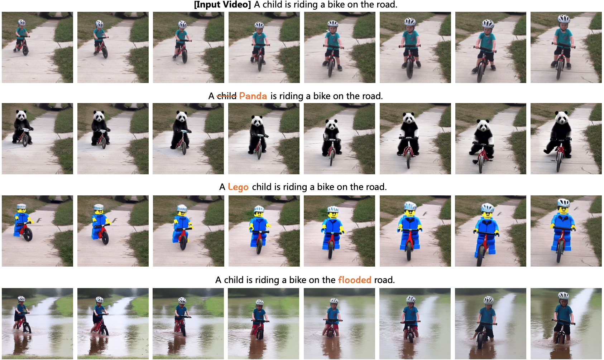

# [CVPR 2024] Video-P2P: Video Editing with Cross-attention Control
The official implementation of [Video-P2P](https://video-p2p.github.io/).

[Shaoteng Liu](https://www.shaotengliu.com/), [Yuechen Zhang](https://julianjuaner.github.io/), [Wenbo Li](https://fenglinglwb.github.io/), [Zhe Lin](https://sites.google.com/site/zhelin625/), [Jiaya Jia](https://jiaya.me/)

[](https://video-p2p.github.io/)
[](https://arxiv.org/abs/2303.04761)
[](https://huggingface.co/spaces/video-p2p-library/Video-P2P-Demo)



## Changelog

- 2023.03.20 Release Demo.
- 2023.03.19 Release Code.
- 2023.03.09 Paper preprint on arxiv.

## Todo

- [x] Release the code with 6 examples.
- [x] Update a faster version.
- [x] Release data.
- [x] Release the Gradio Demo.
- [x] Add local Gradio Demo.
- [ ] Release more configs and new applications.

## Setup

``` bash
conda create --name vp2p python=3.9
conda activate vp2p
pip install -r requirements.txt
```

The code was tested on both Tesla V100 32GB and RTX3090 24GB. At least 20GB VRAM is required.

The environment is similar to [Tune-A-Video](https://github.com/showlab/Tune-A-Video) and [prompt-to-prompt](https://github.com/google/prompt-to-prompt/).

[xformers](https://github.com/facebookresearch/xformers) on 3090 may meet this [issue](https://github.com/bryandlee/Tune-A-Video/issues/4).

## Quickstart

Please replace **pretrained_model_path** with the path to your stable-diffusion.

To download the pre-trained model, please refer to [diffusers](https://github.com/huggingface/diffusers).

Please download [sd1.5](https://huggingface.co/runwayml/stable-diffusion-v1-5) and fill the path at this [line](https://github.com/dvlab-research/Video-P2P/blob/c916cf4b10e7a105cc78688b41210a1543a8d9c9/configs/rabbit-jump-tune.yaml#L1C48-L1C69).


``` bash
# Stage 1: Tuning to do model initialization.

# You can minimize the tuning epochs to speed up.
python run_tuning.py  --config="configs/rabbit-jump-tune.yaml"
```

``` bash
# Stage 2: Attention Control

# We develop a faster mode (1 min on V100):
python run_videop2p.py --config="configs/rabbit-jump-p2p.yaml" --fast

# The official mode (10 mins on V100, more stable):
python run_videop2p.py --config="configs/rabbit-jump-p2p.yaml"
```

Find your results in **Video-P2P/outputs/xxx/results**.

## Dataset

We release our dataset [here](https://drive.google.com/drive/folders/1EN501LLVg4FPeZ39lEBYHdXrs7nc5wDb?usp=sharing).

Download them under **./data** and explore your creativity!

## Results

<table class="center">
<tr>
  <td width=50% style="text-align:center;">configs/rabbit-jump-p2p.yaml</td>
  <td width=50% style="text-align:center;">configs/penguin-run-p2p.yaml</td>
</tr>
<tr>
  <td></td>
  <td></td>
</tr>
<tr>
  <td width=50% style="text-align:center;">configs/man-motor-p2p.yaml</td>
  <td width=50% style="text-align:center;">configs/car-drive-p2p.yaml</td>
</tr>
<tr>
  <td></td>
  <td></td>
</tr>
<tr>
  <td width=50% style="text-align:center;">configs/tiger-forest-p2p.yaml</td>
  <td width=50% style="text-align:center;">configs/bird-forest-p2p.yaml</td>
</tr>
<tr>
  <td></td>
  <td></td>
</tr>
</table>

## Gradio demo
Running the following command to launch the local demo built with [gradio](https://gradio.app/): 
``` bash
python app_gradio.py
```
Find the demo on HuggingFace [here](https://huggingface.co/spaces/video-p2p-library/Video-P2P-Demo). The demo code borrows heavily from [Tune-A-Video](https://huggingface.co/spaces/Tune-A-Video-library/Tune-A-Video-Training-UI).

## Citation 
```
@misc{liu2023videop2p,
      author={Liu, Shaoteng and Zhang, Yuechen and Li, Wenbo and Lin, Zhe and Jia, Jiaya},
      title={Video-P2P: Video Editing with Cross-attention Control}, 
      journal={arXiv:2303.04761},
      year={2023},
}
``` 

## References
* prompt-to-prompt: https://github.com/google/prompt-to-prompt
* Tune-A-Video: https://github.com/showlab/Tune-A-Video
* diffusers: https://github.com/huggingface/diffusers
